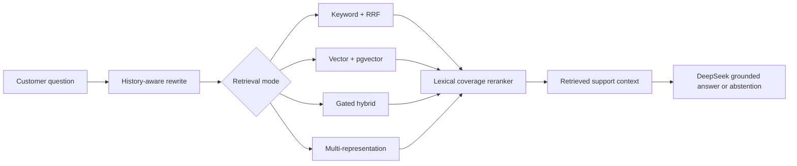

# SupplierFlow

A demo B2B assistant for product-catalogue and supplier-policy questions.

SupplierFlow combines catalogue facts, supplier policies and technical reference notes into a
grounded chat experience. It is a synthetic-data project built to study retrieval quality,
answer grounding and safe abstention.

> Demo only: the corpus is synthetic and the measured results below are local evaluation
> results, not production SLAs.

## Highlights

- Product and policy question answering with cited source documents.
- Keyword, vector, gated-hybrid and multi-representation retrieval.
- History-aware query rewriting and dependency-free lexical coverage reranking.
- Explicit abstention for unsupported requests such as missing prices, stock quantities and
  Singapore delivery terms.
- Evaluation harness for retrieval, answer correctness, faithfulness, context coverage,
  abstention, latency, tokens and estimated cost.

## Architecture



## Retrieval modes

| Mode | Behaviour |
| --- | --- |
| `keyword` | Term overlap and reciprocal-rank fusion; current default. |
| `vector` | OpenAI query embedding and pgvector cosine search with a similarity floor. |
| `hybrid` | Vector gate plus keyword recall booster, fused with reciprocal rank. |
| `multi` | Extractive document-summary selection followed by full-chunk retrieval. |

The shipping candidate uses `keyword` retrieval with `history` rewriting and `lexical`
reranking. Vector, hybrid, multi-representation and HyDE are controlled experiment arms.

## Measured results

The current fixture contains 44 source documents and 159 file chunks. The live evaluation has
139 labelled questions: 70 direct lookups, 44 adversarial cases and 25 negative questions.

| Measurement | Result |
| --- | ---: |
| Live evaluation pass rate | **139/139** |
| Hallucinations on negative questions | **0/25** |
| Top-1 source hit rate, baseline → coverage rerank | **82.5% → 89.5%** (+7.0 pp) |
| Top-1 fully answerable rate, baseline → coverage rerank | **67.5% → 74.6%** |
| Client latency | **3.28 s p50 / 6.35 s p95** |

The retrieval A/B result is from 114 answerable questions. The live result used keyword
retrieval, lexical reranking and history-aware rewriting; all numbers come from the evaluation
harness rather than estimates.

## Quick start

### Requirements

- Node.js `>=22.13.0`
- A Supabase project with the schema and migrations applied
- A DeepSeek API key for generated chat answers
- An OpenAI API key for embeddings and vector retrieval

### Install

```bash
git clone <your-repository-url>
cd supplierflow
npm install
```

Create `.env` locally. Never commit it:

```text
SUPABASE_URL=
SUPABASE_ANON_KEY=
SUPABASE_SERVICE_ROLE_KEY=
DEEPSEEK_API_KEY=
OPENAI_API_KEY=
```

Apply `supabase/schema.sql`, then the SQL files in `supabase/migrations/` in filename order.

Import the knowledge base and seed catalogue products:

```bash
node scripts/import-knowledge.mjs --dry-run
node scripts/import-knowledge.mjs
node scripts/seed-products.mjs
npm run dev
```

For keyword-only retrieval, use `node scripts/import-knowledge.mjs --no-embed` instead. Vector
and hybrid retrieval require embedded chunks.

The app is then available at `http://localhost:3000` unless the development server is
configured to use another port.

## Evaluation

Run the fixture validation before trusting a result:

```bash
node tests/rag-eval/verify-groundtruth.mjs
node --test tests/rag-eval/grader.test.mjs
```

Offline retrieval evaluation:

```bash
node tests/rag-eval/run-retrieval-eval.mjs --chunking fixed --k 5 --json tests/rag-eval/results-retrieval.json
node tests/rag-eval/run-ab-retrieval.mjs --k 5 --json tests/rag-eval/results-ab.json
```

Live end-to-end evaluation:

```bash
node tests/rag-eval/run-live-eval.mjs --base http://localhost:3000 --delay 400 --concurrency 5
```

The complete evaluation guide is in [`tests/rag-eval/README.md`](tests/rag-eval/README.md).

Run the application checks with:

```bash
npm test
npm run lint
```

## Configuration

The main retrieval settings are:

```text
RETRIEVAL_MODE=keyword
RETRIEVAL_TOP_K=5
RETRIEVAL_RERANKER=lexical
QUERY_REWRITE_MODE=history
```

The retrieval implementation is intentionally hand-rolled rather than hidden behind a RAG
framework, so each retrieval and grading decision can be inspected in the source.

## Repository layout

```text
app/api/ai-chat/       # chat route, query rewriting and retrieval
data/                  # product, policy and technical reference documents
scripts/               # knowledge import, embedding and product seeding
supabase/              # schema and database migrations
tests/rag-eval/        # ground truth, retrieval A/B and live evaluation
```

## Current limitations

- Production chunking uses fixed 100-word windows without overlap.
- The default live path is keyword plus lexical reranking; vector and multi-representation
  modes are opt-in experiments.
- This repository does not claim full CRAG yet: graded retrieval evaluation, three-way routing,
  context refinement and rewrite-and-abstain fallback remain planned work.
- The data is synthetic and intended for demonstration and learning.
